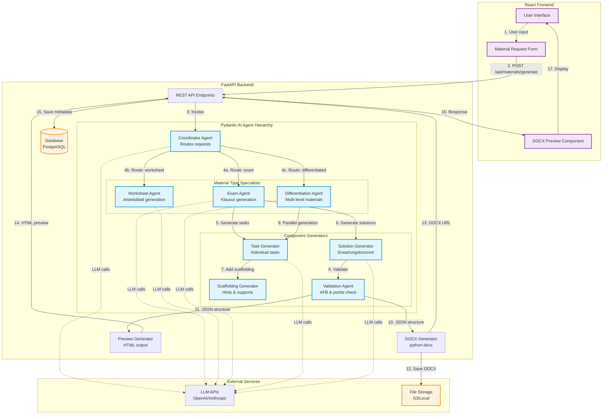

# Material Agent Architecture Research Report

**Date:** 2026-02-14  
**Focus:** Hierarchical Multi-Agent Systems for Educational Material Generation  
**Stack:** FastAPI + Pydantic AI + React

---

## Executive Summary

This research report provides comprehensive findings on building hierarchical multi-agent systems specifically for generating educational materials (Klausuren, Arbeitsblätter, differentiated content). The recommended architecture uses **Pydantic AI** for agent orchestration with **FastAPI** as the API layer and **React** for the frontend, leveraging the **docx** library for document generation with browser-based preview capabilities.

---

## 1. Pydantic AI Nested Agents

### Key Findings

**Official Documentation:**
- **Source:** https://ai.pydantic.dev/multi-agent-applications/
- Pydantic AI supports 5 complexity levels for agentic systems:
  1. Single agent workflows
  2. **Agent delegation** — agents using another agent via tools
  3. **Programmatic agent hand-off** — sequential agent calls with human/code orchestration
  4. Graph-based control flow
  5. Deep agents (autonomous with planning, file ops, task delegation)

**Agent-as-Tool Pattern:**
```python
from pydantic_ai import Agent, RunContext

# Parent agent (orchestrator)
material_coordinator = Agent(
    'openai:gpt-5.2',
    instructions='Use sub-agents to generate educational materials.',
)

# Delegate agent (specialist)
exam_generator = Agent(
    'gemini:gemini-3-flash-preview',
    output_type=ExamStructure,
)

@material_coordinator.tool
async def generate_exam(ctx: RunContext[Deps], topic: str, afb_distribution: dict) -> ExamStructure:
    """Generate an exam using the specialized exam agent."""
    result = await exam_generator.run(
        f'Create exam for topic: {topic}',
        deps=ctx.deps,  # Pass dependencies down
        usage=ctx.usage,  # Track usage across agents
    )
    return result.output
```

**Key Principles:**
1. **Dependency Sharing:** Delegate agents should have same or subset of parent dependencies
2. **Usage Tracking:** Always pass `usage=ctx.usage` to accumulate costs/tokens
3. **Context Isolation:** Subagents use isolated context windows, returning only relevant info
4. **Parallelization:** Can spin up multiple subagents simultaneously for different tasks

**Best Practices from Anthropic & Pydantic AI:**
- Start simple, add complexity only when needed
- Agents are **stateless and global** — instantiate once, reuse everywhere (like FastAPI routers)
- Use agent delegation when flexibility and model-driven decisions are needed
- For predictable workflows, use simple programmatic hand-off instead

**Community Examples:**
- GitHub Issue: [#2356](https://github.com/pydantic/pydantic-ai/issues/2356) — Streaming progress from nested agents
- GitHub Issue: [#300](https://github.com/pydantic/pydantic-ai/issues/300) — Multi-agent application patterns

---

## 2. Material Generation with KI for Teachers

### Educational Material Requirements

**German Educational Standards (AFB I-III):**

**AFB I (Anforderungsbereich I) — Reproduktion (20-30%)**
- Wiedergabe von Fakten, Begriffen, Definitionen
- Beschreiben bekannter Verfahren
- Example tasks: "Nenne...", "Beschreibe...", "Gib wieder..."

**AFB II (Anforderungsbereich II) — Reorganisation/Transfer (40-60%)**
- Anwenden von Gelerntem auf neue Kontexte
- Vergleichen, Analysieren, Erklären
- Example tasks: "Erläutere...", "Vergleiche...", "Analysiere..."

**AFB III (Anforderungsbereich III) — Reflexion/Problemlösung (10-30%)**
- Bewerten, Beurteilen, Entwickeln eigener Lösungen
- Example tasks: "Bewerte...", "Entwickle...", "Diskutiere..."

**Sources:**
- https://www.jag-bad-berleburg.de/organisiertesjag/plaene/curricula/651-biologie-sii-ef-q1-q2-nur-leistungsbewertung
- https://www.bkvb.de/wp-content/uploads/2018/downloads/Diverses/Bewertung_Klausuren_Nov_15.pdf

**Erwartungshorizont Structure:**
1. **Aufgabenbeschreibung:** Clear task description
2. **Erwartete Inhalte:** Expected content/solutions
3. **AFB-Zuordnung:** Assignment to competency levels
4. **Punkteverteilung:** Point distribution per subtask
5. **Bewertungsraster:** Grading rubric with criteria

**Differentiation (Niveaustufen):**

**Basis-Niveau:**
- Simplified language
- Scaffolding through step-by-step instructions
- Visual aids and examples
- Reduced complexity

**Mittel-Niveau:**
- Standard curriculum requirements
- Moderate guidance
- Mix of scaffolded and open tasks

**Erweitert-Niveau:**
- Advanced language and concepts
- Open-ended tasks
- Transfer to new contexts
- Higher cognitive load

**Scaffolding Strategies:**
- **Proactive agents:** AI that asks guiding questions (not just reactive)
- **Leveled readers:** Same content at different reading levels
- **Graphic organizers:** Visual structures for organizing information
- **Sentence starters:** Templates for written responses
- **Chunking:** Breaking complex tasks into smaller steps

**AI Tools Doing This Well:**
- **Diffit** (https://web.diffit.me/) — Generates differentiated readings at multiple levels
- **SchoolAI** (https://schoolai.com/) — AI tutors for personalized scaffolding
- **MagicSchool** — Differentiation tool suites for teachers

---

## 3. DOCX Generation in JavaScript/TypeScript

### Library Recommendations

**Primary Library: docx (by dolanmiu)**

**Repository:** https://github.com/dolanmiu/docx  
**NPM:** https://www.npmjs.com/package/docx  
**Docs:** https://docx.js.org/

**Why docx?**
- ✅ Works in **Node.js AND browser** (client-side)
- ✅ TypeScript-native with excellent type definitions
- ✅ Declarative API (similar to React JSX)
- ✅ Rich feature set: headers, footers, tables, images, numbering, styles
- ✅ Active maintenance (1.9M weekly downloads)
- ✅ Interactive playground: https://docxjs-editor.vercel.app/

**Example Usage:**
```typescript
import { Document, Packer, Paragraph, TextRun, HeadingLevel, Table, TableRow, TableCell } from 'docx';

// Create exam document
const doc = new Document({
  sections: [{
    properties: {},
    children: [
      new Paragraph({
        text: "Klausur: Biologie",
        heading: HeadingLevel.HEADING_1,
      }),
      new Paragraph({
        children: [
          new TextRun({ text: "Name: ", bold: true }),
          new TextRun("_____________________"),
        ],
      }),
      // Task 1 - AFB I
      new Paragraph({
        text: "Aufgabe 1 (AFB I - 6 Punkte)",
        heading: HeadingLevel.HEADING_2,
      }),
      new Paragraph({
        text: "Beschreibe den Aufbau einer Pflanzenzelle.",
      }),
      // Grading rubric as table
      new Table({
        rows: [
          new TableRow({
            children: [
              new TableCell({ children: [new Paragraph("Kriterium")] }),
              new TableCell({ children: [new Paragraph("Punkte")] }),
            ],
          }),
          new TableRow({
            children: [
              new TableCell({ children: [new Paragraph("Zellwand erwähnt")] }),
              new TableCell({ children: [new Paragraph("2")] }),
            ],
          }),
        ],
      }),
    ],
  }],
});

// Generate blob (browser) or buffer (Node.js)
const blob = await Packer.toBlob(doc);
```

**Alternative Libraries (Considered but not recommended):**
- **officegen** — Older, callback-based API, less maintained
- **docx-templates** — Good for filling templates but not programmatic generation
- **@progfay/docx-templates** — Template-based, not suitable for dynamic generation

---

### Browser Preview Options

**Option 1: docx-preview (HTML Rendering)**

**Repository:** https://github.com/VolodymyrBaydalka/docxjs  
**NPM:** https://www.npmjs.com/package/docx-preview

**Pros:**
- ✅ Renders DOCX to HTML directly in browser
- ✅ No server-side dependencies
- ✅ Semantic HTML output

**Cons:**
- ❌ Limited by HTML capabilities (no pixel-perfect rendering)
- ❌ Complex formatting may not render correctly

**Example:**
```typescript
import * as docxPreview from 'docx-preview';

// docxBlob is the generated DOCX file
docxPreview.renderAsync(docxBlob, document.getElementById('preview-container'));
```

**Option 2: Convert DOCX → PDF → Display with PDF.js**

**For Client-Side Conversion:**
- **Nutrient Web SDK** (https://www.nutrient.io/) — Commercial, no server needed
- **Apryse WebViewer** (https://apryse.com/) — Commercial, supports DOCX → PDF in browser

**For Server-Side Conversion:**
- **LibreOffice** (via `libreoffice --headless --convert-to pdf`)
- **docx-pdf** NPM package (Node.js, requires LibreOffice)
- **Gotenberg** (Docker service for document conversion)

**Then display with PDF.js:**
```typescript
import * as pdfjsLib from 'pdfjs-dist';

const loadingTask = pdfjsLib.getDocument(pdfUrl);
const pdf = await loadingTask.promise;
const page = await pdf.getPage(1);
// Render to canvas...
```

**Option 3: Google Docs Viewer (Iframe Embed)**

Simple but limited:
```html
<iframe src="https://docs.google.com/viewer?url=YOUR_DOCX_URL&embedded=true"></iframe>
```

**Cons:** Requires publicly accessible URL, privacy concerns

---

### Recommended Approach for This Project

**Generation:** Use **docx** library (Node.js backend with FastAPI)  
**Preview:** Use **docx-preview** for quick HTML preview in React  
**Download:** Provide DOCX download button  
**Optional PDF:** Add server-side DOCX → PDF conversion (LibreOffice/Gotenberg) for final export

---

## 4. Data Structures for Teaching Materials

### Recommended JSON Schemas

#### 4.1 Klausur (Exam) Schema

```json
{
  "$schema": "http://json-schema.org/draft-07/schema#",
  "type": "object",
  "title": "Klausur",
  "required": ["id", "title", "subject", "grade", "duration", "tasks", "erwartungshorizont"],
  "properties": {
    "id": {
      "type": "string",
      "format": "uuid"
    },
    "title": {
      "type": "string",
      "description": "Exam title"
    },
    "subject": {
      "type": "string",
      "description": "Subject (Biologie, Deutsch, etc.)"
    },
    "grade": {
      "type": "string",
      "description": "Grade level (e.g., '10. Klasse', 'Q1')"
    },
    "topic": {
      "type": "string",
      "description": "Main topic/unit"
    },
    "duration": {
      "type": "integer",
      "description": "Duration in minutes"
    },
    "totalPoints": {
      "type": "integer",
      "description": "Total points available"
    },
    "afbDistribution": {
      "type": "object",
      "description": "Point distribution across competency levels",
      "properties": {
        "afb1": { "type": "number", "minimum": 0, "maximum": 100 },
        "afb2": { "type": "number", "minimum": 0, "maximum": 100 },
        "afb3": { "type": "number", "minimum": 0, "maximum": 100 }
      }
    },
    "tasks": {
      "type": "array",
      "items": {
        "$ref": "#/definitions/Task"
      }
    },
    "erwartungshorizont": {
      "$ref": "#/definitions/Erwartungshorizont"
    },
    "hilfsmittel": {
      "type": "array",
      "items": { "type": "string" },
      "description": "Allowed materials (e.g., 'Taschenrechner', 'Formelsammlung')"
    },
    "metadata": {
      "type": "object",
      "properties": {
        "createdBy": { "type": "string" },
        "createdAt": { "type": "string", "format": "date-time" },
        "version": { "type": "string" }
      }
    }
  },
  "definitions": {
    "Task": {
      "type": "object",
      "required": ["id", "nummer", "text", "afb", "punkte"],
      "properties": {
        "id": { "type": "string", "format": "uuid" },
        "nummer": { "type": "string", "description": "Task number (e.g., '1', '2a', '2b')" },
        "text": { "type": "string", "description": "Task description" },
        "afb": {
          "type": "string",
          "enum": ["AFB_I", "AFB_II", "AFB_III"],
          "description": "Competency level"
        },
        "punkte": { "type": "integer", "minimum": 1 },
        "subtasks": {
          "type": "array",
          "items": { "$ref": "#/definitions/Task" }
        },
        "materials": {
          "type": "array",
          "items": {
            "type": "object",
            "properties": {
              "type": { "type": "string", "enum": ["image", "text", "table", "diagram"] },
              "url": { "type": "string" },
              "caption": { "type": "string" }
            }
          }
        },
        "scaffolding": {
          "type": "object",
          "properties": {
            "hints": { "type": "array", "items": { "type": "string" } },
            "sentenceStarters": { "type": "array", "items": { "type": "string" } },
            "visualAids": { "type": "array", "items": { "type": "string" } }
          }
        }
      }
    },
    "Erwartungshorizont": {
      "type": "object",
      "required": ["solutions"],
      "properties": {
        "solutions": {
          "type": "array",
          "items": {
            "type": "object",
            "properties": {
              "taskId": { "type": "string" },
              "expectedContent": {
                "type": "array",
                "items": { "type": "string" },
                "description": "List of expected content elements"
              },
              "pointDistribution": {
                "type": "array",
                "items": {
                  "type": "object",
                  "properties": {
                    "criterion": { "type": "string" },
                    "points": { "type": "integer" }
                  }
                }
              },
              "exampleAnswer": { "type": "string" }
            }
          }
        },
        "bewertungsraster": {
          "$ref": "#/definitions/Bewertungsraster"
        }
      }
    },
    "Bewertungsraster": {
      "type": "object",
      "description": "Grading rubric",
      "properties": {
        "criteria": {
          "type": "array",
          "items": {
            "type": "object",
            "properties": {
              "name": { "type": "string" },
              "description": { "type": "string" },
              "maxPoints": { "type": "integer" },
              "levels": {
                "type": "array",
                "items": {
                  "type": "object",
                  "properties": {
                    "level": { "type": "string", "enum": ["vollständig", "teilweise", "unzureichend", "nicht erfüllt"] },
                    "points": { "type": "integer" },
                    "description": { "type": "string" }
                  }
                }
              }
            }
          }
        },
        "notenschlüssel": {
          "type": "array",
          "items": {
            "type": "object",
            "properties": {
              "grade": { "type": "string" },
              "minPercentage": { "type": "number" },
              "maxPercentage": { "type": "number" }
            }
          }
        }
      }
    }
  }
}
```

#### 4.2 Arbeitsblatt (Worksheet) Schema

```json
{
  "$schema": "http://json-schema.org/draft-07/schema#",
  "type": "object",
  "title": "Arbeitsblatt",
  "required": ["id", "title", "subject", "grade", "sections"],
  "properties": {
    "id": { "type": "string", "format": "uuid" },
    "title": { "type": "string" },
    "subject": { "type": "string" },
    "grade": { "type": "string" },
    "topic": { "type": "string" },
    "lernziele": {
      "type": "array",
      "items": { "type": "string" },
      "description": "Learning objectives"
    },
    "sections": {
      "type": "array",
      "items": {
        "type": "object",
        "properties": {
          "id": { "type": "string" },
          "type": { "type": "string", "enum": ["text", "task", "image", "table", "question"] },
          "heading": { "type": "string" },
          "content": { "type": "string" },
          "tasks": {
            "type": "array",
            "items": {
              "type": "object",
              "properties": {
                "nummer": { "type": "string" },
                "text": { "type": "string" },
                "type": { "type": "string", "enum": ["open", "multiple-choice", "fill-blank", "matching"] },
                "difficulty": { "type": "string", "enum": ["basis", "mittel", "erweitert"] }
              }
            }
          },
          "images": {
            "type": "array",
            "items": {
              "type": "object",
              "properties": {
                "url": { "type": "string" },
                "caption": { "type": "string" },
                "width": { "type": "string" }
              }
            }
          }
        }
      }
    },
    "solutions": {
      "type": "object",
      "description": "Optional answer key",
      "properties": {
        "includeInDocument": { "type": "boolean" },
        "answers": {
          "type": "array",
          "items": {
            "type": "object",
            "properties": {
              "taskId": { "type": "string" },
              "answer": { "type": "string" }
            }
          }
        }
      }
    }
  }
}
```

#### 4.3 Differentiated Material Schema

```json
{
  "$schema": "http://json-schema.org/draft-07/schema#",
  "type": "object",
  "title": "DifferentiatedMaterial",
  "required": ["id", "baseMaterial", "levels"],
  "properties": {
    "id": { "type": "string", "format": "uuid" },
    "baseMaterial": {
      "type": "object",
      "description": "The core content, adapted for each level",
      "properties": {
        "topic": { "type": "string" },
        "subject": { "type": "string" },
        "grade": { "type": "string" },
        "lernziele": { "type": "array", "items": { "type": "string" } }
      }
    },
    "levels": {
      "type": "object",
      "required": ["basis", "mittel", "erweitert"],
      "properties": {
        "basis": { "$ref": "#/definitions/Level" },
        "mittel": { "$ref": "#/definitions/Level" },
        "erweitert": { "$ref": "#/definitions/Level" }
      }
    }
  },
  "definitions": {
    "Level": {
      "type": "object",
      "properties": {
        "readingLevel": {
          "type": "string",
          "description": "Flesch reading ease or similar metric"
        },
        "scaffolding": {
          "type": "object",
          "properties": {
            "vocabulary": {
              "type": "array",
              "items": {
                "type": "object",
                "properties": {
                  "term": { "type": "string" },
                  "definition": { "type": "string" }
                }
              }
            },
            "sentenceStarters": { "type": "array", "items": { "type": "string" } },
            "graphicOrganizers": { "type": "array", "items": { "type": "string" } },
            "hints": { "type": "array", "items": { "type": "string" } }
          }
        },
        "content": {
          "type": "object",
          "description": "The actual material content for this level",
          "properties": {
            "text": { "type": "string" },
            "tasks": { "type": "array", "items": { "type": "object" } },
            "complexity": {
              "type": "string",
              "enum": ["simplified", "standard", "advanced"]
            }
          }
        }
      }
    }
  }
}
```

---

## 5. Agent Orchestration Patterns

### Anthropic's Best Practices

**Source:** https://www.anthropic.com/engineering/building-effective-agents

#### 5.1 Workflow Patterns

**1. Prompt Chaining**
- Decompose task into sequential steps
- Each LLM call processes previous output
- Add programmatic "gates" for validation
- **Use case:** Generate outline → validate → write document

**2. Routing**
- Classify input and route to specialized agent
- **Use case:** Route exam vs. worksheet vs. differentiation requests

**3. Parallelization**
- **Sectioning:** Break into independent subtasks (run in parallel)
- **Voting:** Run same task multiple times for consensus
- **Use case:** Generate basis/mittel/erweitert materials simultaneously

**4. Orchestrator-Workers**
- Central LLM dynamically breaks down tasks
- Delegates to worker agents
- Synthesizes results
- **Use case:** Complex exam generation with multiple sections

**5. Evaluator-Optimizer**
- One agent generates, another evaluates in loop
- **Use case:** Generate exam → validate AFB distribution → refine

#### 5.2 Agent Principles

**From Anthropic:**
1. **Maintain simplicity** — Start with single agent, add complexity only when needed
2. **Prioritize transparency** — Show agent's planning steps explicitly
3. **Craft your Agent-Computer Interface (ACI)** — Thoughtful tool documentation

**Tool Design (Poka-Yoke):**
- Put yourself in the model's shoes
- Use clear parameter names and descriptions
- Include examples in tool docstrings
- Test tools extensively
- Make mistakes hard (e.g., require absolute paths, not relative)

#### 5.3 Error Handling in Sub-Agent Chains

**Best Practices:**

**1. Usage Limits**
```python
from pydantic_ai import UsageLimits

result = await agent.run(
    prompt,
    usage_limits=UsageLimits(
        request_limit=10,  # Max API calls
        total_tokens_limit=50000,  # Max tokens
        tool_calls_limit=20,  # Max tool executions
    )
)
```

**2. Retries with Exponential Backoff**
```python
@agent.tool(retries=3)  # Retry up to 3 times
async def flaky_api_call(ctx: RunContext) -> str:
    # May raise ModelRetry for retry
    return await call_external_api()
```

**3. Validation and Error Messages**
```python
from pydantic_ai import ModelRetry

@agent.tool
async def validate_exam_structure(ctx: RunContext, exam: Exam) -> str:
    afb_total = exam.afbDistribution.afb1 + exam.afbDistribution.afb2 + exam.afbDistribution.afb3
    if not (99 <= afb_total <= 101):  # Allow for rounding
        raise ModelRetry(
            f'AFB distribution must sum to 100%, got {afb_total}%. '
            f'Adjust the distribution and try again.'
        )
    return "Validation passed"
```

**4. Graceful Degradation**
- If sub-agent fails, fall back to simpler agent or cached result
- Log failures for review
- Return partial results when possible

**5. Human-in-the-Loop for Critical Decisions**
```python
from pydantic_ai.tools import ToolApproval

@agent.tool(approval_required=True)
async def publish_exam(ctx: RunContext, exam: Exam) -> str:
    """Publish exam to student portal. Requires teacher approval."""
    # This will pause and wait for approval via the RunContext
    return f"Published exam {exam.id}"
```

---

### Pydantic AI Recommended Patterns

**Multi-Step Workflows:**

**Pattern 1: Sequential Agents (Programmatic Hand-off)**
```python
# Step 1: Content generation agent
content_result = await content_agent.run("Generate Klausur on Photosynthesis")

# Step 2: AFB validation agent
validation_result = await validation_agent.run(
    f"Validate AFB distribution for: {content_result.output}",
    message_history=content_result.new_messages()
)

# Step 3: DOCX generation agent
docx_result = await docx_agent.run(
    f"Generate DOCX from: {validation_result.output}"
)
```

**Pattern 2: Orchestrator-Workers (Agent Delegation)**
```python
coordinator_agent = Agent('openai:gpt-5.2')

@coordinator_agent.tool
async def generate_task(ctx: RunContext, afb_level: str, topic: str) -> Task:
    # Delegate to specialist agent
    return await task_generator_agent.run(
        f"Generate AFB {afb_level} task on {topic}",
        deps=ctx.deps,
        usage=ctx.usage,
    ).output
```

**Pattern 3: Parallel Generation**
```python
import asyncio

async def generate_differentiated_materials(topic: str) -> dict:
    # Generate all levels in parallel
    basis_task = basis_agent.run(f"Generate basis-level material on {topic}")
    mittel_task = mittel_agent.run(f"Generate mittel-level material on {topic}")
    erweitert_task = erweitert_agent.run(f"Generate erweitert-level material on {topic}")
    
    basis, mittel, erweitert = await asyncio.gather(basis_task, mittel_task, erweitert_task)
    
    return {
        "basis": basis.output,
        "mittel": mittel.output,
        "erweitert": erweitert.output,
    }
```

---

## 6. Recommendations for Our Stack

### Architecture Overview

**Backend: FastAPI + Pydantic AI**
- FastAPI for REST API endpoints
- Pydantic AI for agent orchestration
- Pydantic models for data validation (shared between FastAPI and Pydantic AI)
- SQLAlchemy/Prisma for persistence

**Frontend: React + TypeScript**
- React components for UI
- TanStack Query for API state management
- docx-preview for in-browser preview
- Form libraries (React Hook Form + Zod) for input validation

**Document Generation:**
- Backend: Use `docx` library (Node.js or Python-docx alternative)
- Option A: Generate DOCX in Python (python-docx), stream to frontend
- Option B: Generate JSON structure in Python, send to Node.js microservice for DOCX generation
- **Recommended:** Option A (simpler, keep in FastAPI)

**Libraries:**

**Python:**
- `pydantic-ai` — Agent framework
- `fastapi` — Web framework
- `python-docx` — DOCX generation (alternative to Node.js docx)
- `sqlalchemy` — Database ORM
- `httpx` — Async HTTP client for external APIs

**TypeScript/React:**
- `docx-preview` — Browser DOCX preview
- `@tanstack/react-query` — Server state
- `zod` — Schema validation
- `react-hook-form` — Form management

---

### Recommended Agent Hierarchy

**Level 1: Coordinator Agent**
- Receives user request (e.g., "Generate Klausur on Cell Biology for 10th grade")
- Determines material type (Klausur, Arbeitsblatt, differentiated)
- Routes to appropriate specialist

**Level 2: Material Type Specialists**
- **Exam Agent:** Generates Klausuren with AFB distribution
- **Worksheet Agent:** Generates Arbeitsblätter
- **Differentiation Agent:** Generates multi-level materials

**Level 3: Component Generators**
- **Task Generator:** Creates individual tasks
- **Solution Generator:** Creates Erwartungshorizont
- **Scaffolding Generator:** Adds hints, sentence starters, etc.
- **Validation Agent:** Validates AFB distribution, point totals

**Level 4: Format Generators**
- **DOCX Agent:** Converts JSON to DOCX
- **Preview Agent:** Generates HTML preview

---

### Proposed Data Flow

```
User Input (React Form)
    ↓
FastAPI Endpoint (/api/materials/generate)
    ↓
Coordinator Agent (Pydantic AI)
    ↓
├─→ Exam Agent (if type=exam)
│   ├─→ Task Generator (AFB I)
│   ├─→ Task Generator (AFB II)
│   ├─→ Task Generator (AFB III)
│   └─→ Solution Generator
│       └─→ Validation Agent
│
├─→ Worksheet Agent (if type=worksheet)
│   └─→ Task Generator
│
└─→ Differentiation Agent (if type=differentiated)
    ├─→ Basis Generator
    ├─→ Mittel Generator
    └─→ Erweitert Generator
    
    ↓
JSON Structure (validated with Pydantic)
    ↓
├─→ DOCX Generator (python-docx)
│   └─→ Returns DOCX blob
│
└─→ Preview Generator
    └─→ Returns HTML preview
    
    ↓
FastAPI Response
    ↓
React Frontend
    ├─→ Display preview (docx-preview)
    └─→ Download DOCX button
```

---

### FastAPI + Pydantic AI Integration

**Example Endpoint:**

```python
from fastapi import FastAPI, HTTPException
from pydantic import BaseModel
from pydantic_ai import Agent
import asyncio

app = FastAPI()

# Define request/response models
class ExamRequest(BaseModel):
    subject: str
    grade: str
    topic: str
    duration: int
    afb_distribution: dict[str, float]

class ExamResponse(BaseModel):
    id: str
    exam: dict  # The generated exam structure
    docx_url: str
    preview_html: str

# Coordinator agent
coordinator = Agent('openai:gpt-5.2')
exam_agent = Agent('openai:gpt-5.2', output_type=ExamStructure)

@coordinator.tool
async def generate_exam_structure(ctx, request: ExamRequest) -> ExamStructure:
    result = await exam_agent.run(
        f"Generate exam for {request.subject}, grade {request.grade}, topic {request.topic}",
        deps=ctx.deps,
        usage=ctx.usage,
    )
    return result.output

@app.post("/api/materials/generate-exam", response_model=ExamResponse)
async def generate_exam(request: ExamRequest):
    try:
        # Run agent
        result = await coordinator.run(
            f"Generate exam: {request.model_dump_json()}",
            deps={"request": request},
        )
        
        # Generate DOCX
        docx_blob = generate_docx_from_structure(result.output)
        docx_url = save_and_get_url(docx_blob)
        
        # Generate preview
        preview_html = generate_preview_html(result.output)
        
        return ExamResponse(
            id=result.output.id,
            exam=result.output.model_dump(),
            docx_url=docx_url,
            preview_html=preview_html,
        )
    except Exception as e:
        raise HTTPException(status_code=500, detail=str(e))
```

**Key Integration Points:**
1. Use Pydantic models for both FastAPI request/response AND Pydantic AI output types
2. Run agents in async FastAPI endpoints
3. Handle errors gracefully with proper HTTP status codes
4. Stream responses for long-running agent tasks (use SSE or WebSockets)

---

## 7. Architecture Diagram (Mermaid)



---

## 8. Implementation Roadmap

### Phase 1: Foundation (Week 1-2)
- [ ] Set up FastAPI project structure
- [ ] Install Pydantic AI and configure models (OpenAI/Anthropic)
- [ ] Define Pydantic schemas for Klausur, Arbeitsblatt, Differentiated Material
- [ ] Implement basic Coordinator Agent with routing
- [ ] Create database schema (PostgreSQL)

### Phase 2: Exam Agent (Week 3-4)
- [ ] Implement Exam Agent with AFB I-III task generation
- [ ] Build Task Generator sub-agent
- [ ] Build Solution Generator (Erwartungshorizont)
- [ ] Build Validation Agent (AFB distribution, point totals)
- [ ] Add error handling and retries
- [ ] Write tests for exam generation

### Phase 3: DOCX Generation (Week 5)
- [ ] Integrate python-docx library
- [ ] Create DOCX templates for Klausuren
- [ ] Implement DOCX generation from JSON
- [ ] Test DOCX formatting (headers, footers, tables, numbering)

### Phase 4: Frontend Preview (Week 6)
- [ ] Set up React project with TypeScript
- [ ] Build material request form (React Hook Form + Zod)
- [ ] Integrate docx-preview for browser preview
- [ ] Add download DOCX functionality
- [ ] Connect to FastAPI backend (TanStack Query)

### Phase 5: Differentiation & Worksheets (Week 7-8)
- [ ] Implement Differentiation Agent (Basis/Mittel/Erweitert)
- [ ] Implement Worksheet Agent
- [ ] Add Scaffolding Generator (hints, sentence starters)
- [ ] Test parallel generation of multi-level materials

### Phase 6: Polish & Deploy (Week 9-10)
- [ ] Add usage tracking and cost monitoring
- [ ] Implement caching for common requests
- [ ] Add human-in-the-loop approval for critical actions
- [ ] Write comprehensive documentation
- [ ] Deploy to production (Docker + Kubernetes or similar)

---

## 9. Key Takeaways & Next Steps

### Summary of Recommendations

✅ **Agent Framework:** Use **Pydantic AI** for hierarchical agent orchestration  
✅ **API Layer:** Use **FastAPI** for REST API  
✅ **DOCX Generation:** Use **python-docx** (Python) or **docx** (Node.js microservice)  
✅ **Preview:** Use **docx-preview** for HTML preview in browser  
✅ **Data Structures:** Implement JSON schemas provided in Section 4  
✅ **Architecture:** 4-level agent hierarchy (Coordinator → Specialists → Components → Formatters)  
✅ **Error Handling:** Usage limits, retries, validation, graceful degradation  

### Open Questions for Discussion

1. **Model Selection:** OpenAI GPT-4.5, Anthropic Claude Sonnet 4.5, or mix?
2. **Caching Strategy:** Cache at agent level or DB level?
3. **Cost Management:** Set usage limits per request? Per user?
4. **Human Review:** At what stage should teachers review/approve generated materials?
5. **Localization:** Support for multiple languages beyond German?

### Next Steps

1. **Prototype Coordinator Agent** with basic routing
2. **Build minimal Exam Agent** for AFB I tasks only
3. **Test DOCX generation** with simple exam structure
4. **Create React form** for exam parameters
5. **Iterate based on teacher feedback**

---

## 10. References & Resources

### Pydantic AI
- Official Docs: https://ai.pydantic.dev/
- Multi-Agent Patterns: https://ai.pydantic.dev/multi-agent-applications/
- GitHub: https://github.com/pydantic/pydantic-ai
- FastAPI Integration: https://ai.pydantic.dev/examples/chat-app/

### Anthropic Agent Patterns
- Building Effective Agents: https://www.anthropic.com/engineering/building-effective-agents
- Agent SDK: https://www.anthropic.com/engineering/building-agents-with-the-claude-agent-sdk
- Tool Use Best Practices: https://www.anthropic.com/engineering/writing-tools-for-agents

### DOCX Generation
- docx library: https://docx.js.org/ (JavaScript/TypeScript)
- docx GitHub: https://github.com/dolanmiu/docx
- docx-preview: https://github.com/VolodymyrBaydalka/docxjs
- python-docx: https://python-docx.readthedocs.io/ (Python alternative)

### Educational AI
- Diffit: https://web.diffit.me/ (Differentiation example)
- SchoolAI: https://schoolai.com/ (AI tutoring)
- German AFB Standards: Multiple sources listed in Section 2

### FastAPI + Pydantic AI Integration
- Appunite Blog: https://tech.appunite.com/posts/building-an-api-for-your-pydantic-ai-agent-with-fast-api-part-2
- Koyeb Tutorial: https://www.koyeb.com/tutorials/using-pydanticai-to-build-ai-agents-for-data-analysis

---

**Report Compiled:** 2026-02-14  
**Research Agent:** OpenClaw Subagent  
**Version:** 1.0
