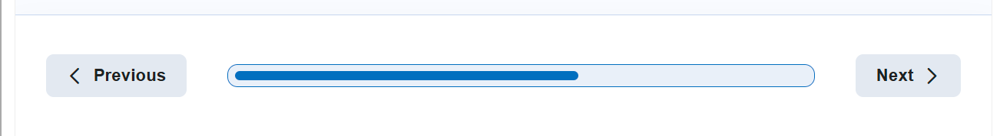

# Navigation

## Elements

* Previous and Next buttons
* After the activity is completed, the Next button is replaced with the button that leads to the Summary Screen, if there is one
* There's usually some sort of progress indicator between the buttons (progress can be shown as dots or a slider, depending on content type)

## Examples of usage

### Question Set

.png>)

### Dialog Cards

.png>)

### Flashcards

.png>)

### Course presentation

A modified version of Navigation is used in “Course Presentation” as this content type have limited space to place navigation in (height of the bar is limited and can’t be changed).

.png>)

### Interactive Book

Though it looks similar, Interactive Book is not currently using the Navigation Component, as it required too much overriding. The IB version has the page count and title between the buttons, and the book progress indicator to the left of the navigation buttons.

.png>)

### Documentation tool

While this content type also has navigation buttons, the look and implementation of them caused technical difficulties when trying to use the Navigation component. It instead uses its own implementation.
