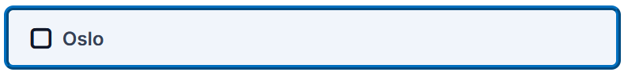

# Alternative

We use the term Alternative to indicate any choice the user can make when answering questions. Examples of usage:

* “Multiple Choice” choices
* “Single Choice Set” choices
* “Multimedia Choice” images
* “Memory Game” cards
* etc.

Note that Alternative  differs a lot from content type to content type, depending on the format of the activity, but they all have these things in common:

* Alternative will always use  `--h5p-theme-alternative-base` as a base color in combination with `--h5p-theme-alternative-light` for hover effect, `--h5p-theme-alternative-dark` for active states, and  `--h5p-theme-alternative-darker` for elements that need more contrast, like border colors, shadows etc.
* Alternative will always use a combination of `--h5p-theme-feedback-incorrect-third`, `--h5p-theme-feedback-incorrect-second`, `--h5p-theme-feedback-incorrect-main` (and same for correct) for feedback mode (see more under Feedback section)

## Examples

Below are some examples of Alternatives in various content types

### Multiple Choice

<table><thead><tr><th width="209">State</th><th>Appearance</th></tr></thead><tbody><tr><td>Normal</td><td>
<figure><figcaption></figcaption></figure>
</td></tr><tr><td>Hover</td><td>
<figure><figcaption></figcaption></figure>
</td></tr><tr><td>Selected</td><td>
<figure><figcaption></figcaption></figure>
</td></tr><tr><td>Focus</td><td>
<figure><figcaption></figcaption></figure>
</td></tr><tr><td>Validated (Correct)</td><td>
<figure><figcaption></figcaption></figure>
</td></tr><tr><td>Validated (Incorrect)</td><td>
<figure><figcaption></figcaption></figure>
</td></tr><tr><td>Validated (Not selected)</td><td>
<figure><figcaption></figcaption></figure>
</td></tr></tbody></table>

### Multi Media Choice

<table><thead><tr><th width="204">State</th><th>Appearance</th></tr></thead><tbody><tr><td>Normal</td><td>
<figure><figcaption></figcaption></figure>
</td></tr><tr><td>Hover</td><td>
<figure><figcaption></figcaption></figure>
</td></tr><tr><td>Selected</td><td>
<figure><figcaption></figcaption></figure>
</td></tr><tr><td>Validated (Correct)</td><td>
<figure><figcaption></figcaption></figure>
</td></tr><tr><td>Validated (Incorrect)</td><td>
<figure><figcaption></figcaption></figure>
</td></tr><tr><td>Validated (Not selected)</td><td>
<figure><figcaption></figcaption></figure>
</td></tr><tr><td>Solution (Not selected, but should have been)</td><td>
<figure><figcaption></figcaption></figure>
</td></tr></tbody></table>

